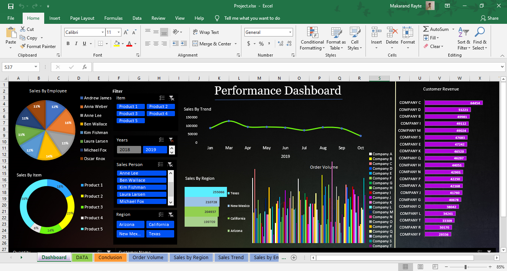

 

It's a excel dashboard with problem statement solution. 

Video Link  : https://drive.google.com/file/d/1XG9II79-w8iTBDNiuDyFfRRXI88xORWF/view?usp=sharing

Excel project : https://drive.google.com/file/d/1AKMaeqMkftoD58elMLro2yXuQLK4G4R4/view?usp=sharing

Dashboard Presentation:

